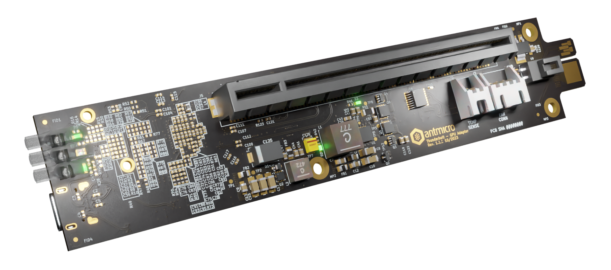

# Thunderbolt to GPU Adapter

Copyright (c) 2023 [Antmicro](https://www.antmicro.com)

## Overview

This project contains open hardware design files for an adapter board wrapping 4-lane (i.e. 4x) PCIe Gen 3.0 devices into a Thunderbolt 3 uplink.
It is based on the Intel/JHL6340SLLSQ Thunderbolt controller.
The design files were prepared in KiCad 6.x.

## Key features

* Intel JHL6340SLLSQ Thunderbolt 3 controller 
* PCIe x16 expansion slot
* On-board Step-Up DC-DC generating 12V (required by some PCIe cards)
* USB-C PD, which provides power for PCIe devices
* Edge power connector which can provide additional power when needed.

## Building a scalable cluster

The Thunderbolt GPU adapter features an edge connector that plays a key role in the scalability and functionality of this solution.
This edge connector is designed for seamless integration with a PCB backplane, allowing multiple PCIe devices to be connected in a cluster.

This approach has the following advantages:

1. Power Distribution
The edge connector is used to power the Thunderbolt GPU adapter from the PCB backplane. This enables efficient and consistent power supply to all connected PCIe devices, while providing power management and monitoring for individual devices.

2. Information Aggregation
Beyond power, the edge connector facilitates communication between the Thunderbolt GPU adapters and the backplane PCB. This communication allows the aggregation of status data from individual boards, providing a centralized view of the entire cluster's health and performance.

3. Ease of Expansion
The modular nature of the board allows for simple expansion of the system, making it scalable, allowing users to incrementally increase computing power by connecting additional cards to the backplane.

4. Simple Connectivity
Thunderbolt's plug-and-play capability eliminates the need for complex configurations. Users can connect eny PCIe devices to host devices effortlessly.

5. Hot Swapping
The Thunderbolt interface supports hot-swapping, allowing users to connect or disconnect PCIe devices without rebooting the host system. This flexibility is particularly for dynamic cluster environments.

## Project structure

The main directory contains KiCad PCB project files, a LICENSE, and a README.
The remaining files are stored in the following directories:

* `lib` - contains the component libraries
* `img` - contains graphics for this README
* `doc` - contains schematics in pdf form

## Licensing

This project is published under the [Apache-2.0](LICENSE) license.

